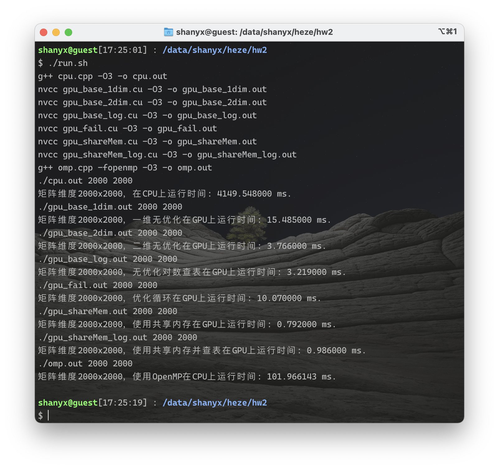

<h1 align=center>Performance analysis of Matrix Entropy Calculation</h1>

[TOC]

## 一、作业要求

> 计算二维数组中以每个元素为中心的熵(entropy)
>
> - $H(X)=-\sum_ip_i\times \log p_i\ \ \ \ \ \ \ \ \ \ \ p_i=p(X=x_i)$
>
> - 信息论的基础概念
>
> - 衡量随机变量分布的“混乱程度”
>
> - 下图计算了红色及绿色的3×3窗口中的熵值
>
>     
>
> - 输入：二维数组及其大小，假设元素为[0,15]的整型
>
> - 输出：浮点型二维数组(保留5位小数)
>
>     - 每个元素中的值为以该元素为中心的大小为5的窗口中值的熵
>     - 当元素位于数组的边界窗口越界时，只考虑数组内的值

> 回答以下问题：
>
> - 介绍程序整体逻辑，包含的函数，每个函数完成的内容。(10分)
>     - 对于核函数，应该说明每个线程块及每个线程所分配的任务
> - 解释程序中涉及哪些类型的存储器(如全局内存、共享内存等)，并通过分析数据的访存模式及该存储器的特性说明为何使用该种存储器。(15分)
> - 程序中的对数运算实际只涉及对整数[1,25]的对数运算，为什么?如使用查表对log1~log25进行查表，是否能加速运算过程? 请通过实验收集运行时间，并验证说明。(15分)
> - 请给出一个基础版本(baseline)及至少一个优化版本。并分析说明每种优化对性能的影响。(40分)
>     - 例如，使用共享内存及不使用共享内存
>     - 优化失败的版本也可以进行比较
> - 对实验结果进行分析，从中归纳总结影响CUDA程序性能的因素。(20分)
> - 可选做:使用OpenMP实现并与CUDA版本进行对比。(20分)

## 二、文件说明

- `src`目录下为源代码文件：
    - `cpu.cpp`为cpu版本
    - `gpu_base_1dim.cu`一维线程组织的baseline版本
    - `gpu_base_2dim.cu`二维线程组织的baseline版本
    - `gpu_base_log.cu`在二维线程组织的baseline版本基础上查对数表
    - `gpu_fail.cu`为减少了一层循环的版本
    - `gpu_shareMem.cu`为在`gpu_fail.cu`基础上使用共享内存
    - `gpu_shareMem_log.cu`为在`gpu_shareMem.cu`基础上查对数表
    - `omp.cpp`使用OpenMP版本
    - `run.sh`为自动编译所有文件并运行所有版本计算2000$\times$2000矩阵的脚本
- `out`目录下为同名源代码的可执行文件

## 三、程序主函数逻辑说明（不含核函数）

**因为下面的各种优化版本主要是核函数不同，main函数都是一样的，所以这一部分先介绍main函数的逻辑**

- 首先开头有两个宏定义define

    ```c
    #define blockSize 10
    #define printArray 0
    ```

    第一个为二维线程块的BlockSize，第二个宏定义为1时代表打印矩阵及结果，为0则不打印

- 然后由运行时的命令行参数获取矩阵的行数和列数，并计算元素个数

    ```c
    int height=atoi(argv[1]);
    int width=atoi(argv[2]);
    int size=height*width;
    ```

- 然后在CPU上分配矩阵和结果的内存

    ```c
    int *host_array,*device_array;
    float *host_result,*device_result;
    cudaMallocHost((void **)&host_array,sizeof(int)*size);
    cudaMallocHost((void **)&host_result,sizeof(float)*size);
    ```

- 随机生成矩阵元素

    ```c
    srand((unsigned)time(0));
    for (int i = 0; i < height; i++) {
        for (int j = 0; j < width; j++) {
            host_array[i * width + j] = rand()%16;
        }
    }
    ```

- 在GPU上分配矩阵和结果的内存

    ```c
    cudaMalloc((void **) &device_array, sizeof(int)*size);
    cudaMalloc((void **) &device_result, sizeof(float)*size);
    cudaMemcpy(device_array, host_array, sizeof(int)*size, cudaMemcpyHostToDevice);
    ```

- 分配线程块大小

    ```c
    unsigned int grid_rows = (height/blockSize)+1;
    unsigned int grid_cols = (width/blockSize)+1;
    dim3 dimGrid(grid_rows, grid_cols);
    dim3 dimBlock(blockSize, blockSize);
    ```

- 调用核函数计算，并在前后计时，最后算出运行时间

    ```c
    clock_t start,end;
    start=clock();
    cal<<<dimGrid, dimBlock>>>(width, height,device_array,device_result);
    cudaDeviceSynchronize();
    end=clock();
    double time_gpu=(double)(end-start)/CLOCKS_PER_SEC;
    ```

- 将结果从GPU拷贝回CPU，打印信息

    ```c
    cudaMemcpy(host_result,device_result, sizeof(float)*size, cudaMemcpyDeviceToHost);
    if(printArray){
        printf("结果：\n");
        for (int i = 0; i < height; i++){
            for (int j = 0; j < width; j++){
                printf("%.5f ",host_result[i*width+j]);
            }
            printf("\n");
        } 
    }
    printf("矩阵维度%dx%d，在GPU上运行时间: %f ms.\n", height,width,time_gpu*1000);
    ```

- 释放内存

    ```c
    cudaFree(host_array);
    cudaFree(host_result);
    cudaFree(device_array);
    cudaFree(device_result);
    ```

**以上便是主函数，下面只说明不同的核函数的逻辑**

## 四、无优化baseline版本（一维&二维实现）

### 1. 一维线程组织

baseline逻辑较为简单，首先计算需计算窗口的四条边分别是哪一行、哪一列，计算窗口总元素个数：

```c
int index = blockIdx.x * blockDim.x + threadIdx.x;
int indexX = index / width;
int indexY = index % width;
int indexLeft = max(0, indexX-2);
int indexRight = min(indexX+3, width);
int indexUp = max(0, indexY-2);
int indexDown = min(indexY+3, height);
int indexNum = (indexRight-indexLeft) * (indexDown-indexUp);
```

然后另k从0-16循环16次，每一次循环的任务是计算窗口中有多少等于k的元素，得到结果后计算概率，再取对数相乘后加到结果中，之后k加一进行下一轮循环：

```c
for(int k=0;k<16;k++) {
    indexTimes = 0;
    for(int i=indexUp;i<indexDown;i++)
        for(int j=indexLeft;j<indexRight;j++) {
            if(array[i * width + j]==k){
                indexTimes++;
            }
        }
    indexP = (float)indexTimes / indexNum;
    if(indexP!=0){
        localResult -= indexP * log2(indexP);
    }
}
```

最后将这个结果写到结果矩阵中：

```c
globalResult[index] = localResult;
```

调用核函数的时候设置一个线程块开1000个线程，块的个数用总元素个数除以1000即可：

```c
cal<<<size/1000, 1000>>>(width, height,device_array,device_result);
```

### 2.二维线程组织

二维与一维的逻辑是一样的，区别只有计算元素的定位和核函数的调用：

- 元素的定位：

    ```c
    int ix = threadIdx.x+blockDim.x*blockIdx.x;
    int iy = threadIdx.y+blockDim.y*blockIdx.y;
    int index = iy+ix*width;
    ```

- 核函数的调用

    ```c
    unsigned int grid_rows = (height/blockSize);
    unsigned int grid_cols = (width/blockSize);
    dim3 dimGrid(grid_rows, grid_cols);
    dim3 dimBlock(blockSize, blockSize);
    cal<<<dimGrid, dimBlock>>>(width, height,device_array,device_result);
    ```

> 注：经测试二维的效果要优于一维（将在“十二、结果对比与结论分析”中说明，这里先给出结论），所以下面的优化都基于二维进行改进。

## 五、优化循环版本

可以看到上面的版本嵌套了三层循环，这其实是可以优化的，就是将最外层的0-16点循环去掉，将一个线程的结果由数变为一个数组，索引窗口元素时直接将元素值作为数组的索引，这样便可以减少15次循环，核函数如下：

```c++
__global__ void cal(int width, int height, int *array, float *globalResult) {
    int ix = threadIdx.x+blockDim.x*blockIdx.x;
    int iy = threadIdx.y+blockDim.y*blockIdx.y;
    int index = ix+iy*width;
    int indexX = index / width;
    int indexY = index % width;
    int indexLeft = max(0, indexY-2);
    int indexRight = min(indexY+3, width);
    int indexUp = max(0, indexX-2);
    int indexDown = min(indexX+3, height);
    int indexNum = (indexRight-indexLeft) * (indexDown-indexUp);
    int indexTimes[16]={0};
    float localResult = 0, indexP;
    for(int i=indexUp;i<indexDown;i++){
        for(int j=indexLeft;j<indexRight;j++) {
            indexTimes[array[i * width + j]]++;
        }
    }
    for(int i=0;i<16;i++){
        indexP = (float)indexTimes[i] / indexNum;
        if(indexP!=0.0){
            localResult -= indexP * log2(indexP);
        }
    }
    globalResult[index] = localResult;
}
```

## 六、使用共享内存版本

上面的版本每个线程少了一层循环，理论上要比baseline快很多，但是经过实际测试却变慢了很多（和前面一样，将在“十二、结果对比与结论分析”中说明，这里先给出结论），这看似是不符合常理的。

于是我猜测原因是因为多定义了一个16个元素的数组为局部变量，但是**由于栈上内存过小，所以在运行时会将数组放在全局内存中**，但是全局内存延迟很大同时要重复多次读取该数组。从而导致时间不降反增。

所以我接下来将该数组放在共享内存中，思路就是在一个block中为每一个thread分配一个唯一的ID，再在共享内存中定义一个大小为16*10\*10的数组，每个线程使用其中的16个元素存放结果，有变化的部分如下：

```c
int shareID=threadIdx.y*blockSize+threadIdx.x;
__shared__ int indexTimes[16*10*10];
float localResult = 0, indexP;
for(int i=indexUp;i<indexDown;i++){
    for(int j=indexLeft;j<indexRight;j++) {
        indexTimes[shareID*16+array[i * width + j]]++;
    }
}
for(int i=0;i<16;i++){
    indexP = (float)indexTimes[i] / indexNum;
    if(indexP!=0.0){
        localResult -= indexP * log2(indexP);
    }
}
```

后面将会提到，这样便会快了很多，也证明了前面推测的原因是正确的。

> 这里回答实验要求中的第二个问题，即解释程序中涉及的存储器。
>
> 在我的程序中，原始矩阵和结果矩阵存放在全局内存中，这是因为每个block的每个thread都会对这两个矩阵进行读取，而每个thread的结果数组则存放在了共享内存中，因为全局内存虽然很大但是延迟很大，频繁读取会导致程序很慢，但是共享内存大延迟很低，故将存放结果的数组放入共享内存，这会使速度有很大的提升。

## 七、查对数表版本

程序中的对数运算确实只涉及整数1-25的运算，因为$\log _2P=\log_2\frac{n}{N}=\log_2n-\log_2N$，而N最大只为25，n在0-25之间，故只涉及整数1-25的对数运算。

首先，在GPU共享内存中写入对数表：

```c
__device__ float logTable[26]={0,
    0.000000000000000,1.000000000000000,1.584962500721156,2.000000000000000,2.321928094887362,
    2.584962500721156,2.807354922057604,3.000000000000000,3.169925001442312,3.321928094887362,
    3.459431618637297,3.584962500721156,3.700439718141092,3.807354922057604,3.906890595608519,
    4.000000000000000,4.087462841250339,4.169925001442312,4.247927513443585,4.321928094887363,
    4.392317422778761,4.459431618637297,4.523561956057013,4.584962500721156,4.643856189774724};
```

在之后的对数计算中只要查表就好了：

```c
localResult -= indexP * (logTable[indexTimes] - logTable[indexNum]);
```

## 八、OpenMP版本

OpenMP的整体思路与前面是一样的，另外由于CPU版本查表会快很多所以这里我也是查对数表而不是每次都计算。

代码和前面几乎是一样的，只是加了OpenMP的语句，核心代码如下：

```c
#pragma omp parallel for
for (int indexY = 0; indexY < height; indexY++){
    for (int indexX = 0; indexX < width; indexX++){
        int indexLeft = max(0, indexY-2);
        int indexRight = min(indexY+3, width);
        int indexUp = max(0, indexX-2);
        int indexDown = min(indexX+3, height);
        int indexNum = (indexRight-indexLeft) * (indexDown-indexUp);
        int indexTimes[16]={0};
        float localResult = 0, indexP;
        for(int i=indexUp;i<indexDown;i++){
            for(int j=indexLeft;j<indexRight;j++) {
                indexTimes[host_array[i * width + j]]++;
            }
        }
        for(int i=0;i<16;i++){
            indexP = (float)indexTimes[i] / indexNum;
            if(indexP!=0.0){
                localResult -= indexP * (logTable[indexTimes[i]]-logTable[indexNum]);
            }
        }
        host_result[indexY*height+indexX] = localResult;
    }
}
```

## 九、运行环境

- 使用的CPU：Intel(R) Xeon(R) Gold 6134 CPU @ 3.20GHz

    

- 使用的GPU：  NVIDIA Tesla V100 32GB

    

- cuda版本：10.1

    

- 此外我还写了一个程序显示当前显卡的一些可能会用到的信息：

    ```c++
    #include<iostream>
    using namespace std;
    int main(){
        int dev = 0;
        cudaDeviceProp devProp;
        cudaGetDeviceProperties(&devProp, dev);
        cout << "使用GPU device " << dev << ": " << devProp.name << endl;
        cout << "SM的数量：" << devProp.multiProcessorCount << endl;
        cout << "每个线程块的共享内存大小：" << devProp.sharedMemPerBlock / 1024.0 << " KB" << endl;
        cout << "每个线程块的最大线程数：" << devProp.maxThreadsPerBlock << endl;
        cout << "每个EM的最大线程数：" << devProp.maxThreadsPerMultiProcessor << endl;
        cout << "每个EM的最大线程束数：" << devProp.maxThreadsPerMultiProcessor / 32 << endl;
        return 0;
    }
    ```

    

## 十、编译运行说明

所有文件需要在运行时在命令中添加两个参数：矩阵行数、列数

例如：

```bash
#编译
g++ cpu.cpp -O3 -o cpu.out
nvcc gpu_base_log.cu -O3 -o gpu_base_log.out
g++ omp.cpp -fopenmp -O3 -o omp.out
#运行
./cpu.out 2000 2000
./gpu_base_log.out 2000 2000
./omp.out 2000 2000
```

此外，由于文件较多，我还写了一个bash脚本自动编译所有文件并运行所有版本计算2000$\times$2000矩阵，运行脚本文件需要先赋权限，示例如下：

```bash
chmod +x run.sh
./run.sh
```

运行脚本截图如下：



## 十一、代码正确性验证

我将baseline的矩阵维数设为5$\times$5，并将输出结果打印出来，手动计算验证结果，程序结果如下：


下面手动计算结果，对于第一个元素12，窗口内共9个元素，其中2、4、5各出现2次，12、14、15各出现一次，故熵为：
$$
H(1)=-\frac{2}{9}\log_2{\frac{2}{9}}-\frac{2}{9}\log_2{\frac{2}{9}}-\frac{2}{9}\log_2{\frac{2}{9}}-\frac{1}{9}\log_2{\frac{1}{9}}-\frac{1}{9}\log_2{\frac{1}{9}}-\frac{1}{9}\log_2{\frac{1}{9}}
$$
对于第二个元素15，窗口内共12个元素，其中4出现4次，2、5、12各出现2次，14、15各出现1次，故熵为：
$$
H(2)=-\frac{4}{12}\log_2{\frac{4}{12}}-\frac{2}{12}\log_2{\frac{2}{12}}-\frac{2}{12}\log_2{\frac{2}{12}}-\frac{2}{12}\log_2{\frac{2}{12}}-\frac{1}{12}\log_2{\frac{1}{12}}-\frac{1}{12}\log_2{\frac{1}{12}}
$$
下面使用python计算这两个式子的值：


可以看到结果2.5032、2.41829（由于精度差异程序计算结果为2.41830）与程序计算所得是相同的，之后我又计算了其他元素发现全部相等，故可以知道程序结果正确。

此外，其余程序的结果我也均与此程序的结果进行了比较，全部正确。

## 十二、结果对比与结论分析

### 1. baseline线程组织一维与二维

首先，将一维线程的cuda版本与CPU版本对比：

<table frame="void" border=0> 
    <tr>
        <td></td> 
        <td></td> 
    </tr>
</table>
将结果绘制成对比图：


可以看出使用GPU即使使用最慢的版本也要比CPU快很多，维数较大时有着多于100倍的加速比。

下面比较CUDA一维与二维线程：


<table frame="void" border=0> 
    <tr>
        <td></td> 
        <td></td> 
    </tr>
</table>

将结果绘制成对比图：


可以看出，baseline版本使用二维线程要比一维快很多，有较为明显的加速效果。

### 2. 优化循环并使用共享内存

<table frame="void" border=0> 
    <tr>
        <td></td> 
        <td></td> 
    </tr>
</table>

将结果绘制成对比图：


由此可以看出将baseline的三层循环变为两层之后**循环数虽然减少了16倍，但是时间却大幅增加**，变成了负优化，这貌似是不符合常理的。

我猜测原因是因为多定义了一个16个元素的数组为局部变量，但是**由于栈上内存过小，所以在运行时会将数组放在全局内存中**，但是全局内存延迟很大同时要重复多次读取该数组。从而导致时间不降反增。

所以将该数组放在共享内存中之后使得时间就如预期一样相对于baseline有了大幅减少，这一结果也印证了前面推测的原因是正确的。

于是减少一层循环并将数组放入共享内存可以获得较好的优化效果。

### 3. 查对数表

<table frame="void" border=0> 
    <tr>
        <td></td> 
        <td></td> 
    </tr>
</table>

将结果绘制成对比图：


由上可以看出对于没有优化的baseline来讲，查对数表是会有一定的优化效果的，但是对于使用了共享内存的版本来讲查表却会变慢，这是因为GPU计算对数相对是比较快的，对于baseline来讲本身就需要大量访问全局内存，所以查表会有一定的优化，但是使用共享内存之后对数计算的速度要比访问全局内存快一些，所以成了负优化。

### 4. OpenMP

<table frame="void" border=0> 
    <tr>
        <td></td> 
        <td></td> 
    </tr>
</table>

将结果绘制成对比图：


可以看出使用OpenMP虽然相对于纯CPU版本快了很多，但是对比CUDA还是很慢，这是CPU与GPU的差距。


至此，可以得出**线程一维二维的组织与共享内存的使用**对于CUDA性能的影响是很大的。
